  <picture>
    <source
      media="(prefers-color-scheme: dark)"
      srcset="assets/dark.svg">
    <source
      media="(prefers-color-scheme: light)"
      srcset="assets/light.svg">
    
  </picture>

<h1 align="center">Hi 👋, I'm Mehdi</h1>
<h3 align="center">A passionate backend and software developer from Iran</h3>

  

- 🌱 I’m currently learning **python**

- 🤝 I’m looking for help with **linux**

- 👨‍💻 All of my projects are available at [https://github.com/Nic-mwh](https://github.com/Nic-mwh)

- 📫 How to reach me **mehdighasemiii309@gmail.com**

<h3 align="left">Connect with me:</h3>

## 📊 GitHub Stats

  
  

<h3 align="left">Languages and Tools:</h3>

        

